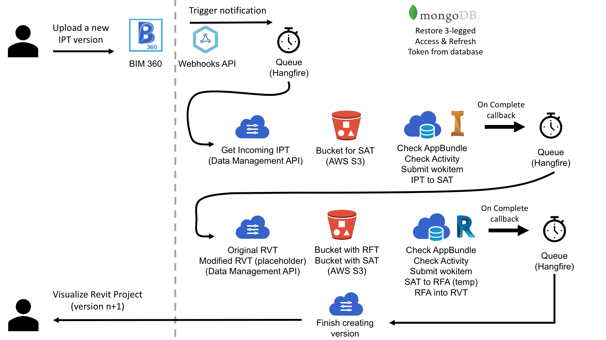

# design.automation-csharp-inventor2revit


[](http://developer.autodesk.com/)
[](http://developer.autodesk.com/)
[](http://developer.autodesk.com/)
[](http://developer.autodesk.com/)


[](http://developer.autodesk.com/)
[](http://developer.autodesk.com/)


[](http://opensource.org/licenses/MIT)

# Description

This sample monitors a BIM 360 Folder for `version.added` event, when a new IPT file (or version) is uploaded, it triggers `Design Automation` for Inventor to convert it to `.SAT` file. Then triggers `Design Automation` for Revit to import this `SAT` file into a new Revit Family `RFA` (using a predefined Revit Family Template, `RFT`). Then opens a Revit `RVT` file (on the same folder where the IPT was uploaded) and updade the family. The resulting Revit file is uploaded back to BIM 360 as a new version.

This sample is based on [this Webhook sample](https://github.com/Autodesk-Forge/data.management-csharp-webhook). Learn more about Webhooks and 3-legged Refresh & Access Token at [this blog post](https://forge.autodesk.com/blog/webhooks-and-bim-360-c). Also based on the [Learn Forge Tutorial](http://learnforge.autodesk.io).

## Thumbnail



## Demonstration

Whatch the recording at [Youtube](https://www.youtube.com/watch?v=gj12qkCNNyM).

## Live version

Try it at [inventor2revit.herokuapp.com](http://inventor2revit.herokuapp.com/), use the **Table_Chair.rvt** and both **Chair_Orientation.ipt** (with and without headrest) sample files at [this folder](https://github.com/autodesk-forge/design.automation-csharp-inventor2revit/tree/master/samplefiles)

# Setup

## Prerequisites

1. **Forge Account**: Learn how to create a Forge Account, activate subscription and create an app at [this tutorial](http://learnforge.autodesk.io/#/account/). 
2. **Visual Studio**: Either Community (Windows) or Code (Windows, MacOS).
3. **.NET Core** basic knowledge with C#
4. **ngrok**: Routing tool, [download here](https://ngrok.com/)
5. **MongoDB**: noSQL database, [learn more](https://www.mongodb.com/). Or use a online version via [mLab](https://mlab.com/) (this is used on this sample)
6. **AWS Account**: S3 buckets are used to store temporary files
7. **Inventor** 2019: required to compile changes into the plugin
8. **Revit** 2019: required to compile changes into the plugin

## Running locally

Clone this project or download it. It's recommended to install [GitHub desktop](https://desktop.github.com/). To clone it via command line, use the following (**Terminal** on MacOSX/Linux, **Git Shell** on Windows):

    git clone https://github.com/autodesk-forge/design.automation-csharp-inventor2revit

**Visual Studio** (Windows):

Right-click on the project, then go to **Debug**. Adjust the settings as shown below. 

 

**Visual Sutdio Code** (Windows, MacOS):

Open the folder, at the bottom-right, select **Yes** and **Restore**. This restores the packages (e.g. Autodesk.Forge) and creates the launch.json file. See *Tips & Tricks* for .NET Core on MacOS.

**Important**: For Visual Code (Windows or MacOS) open only the `/web/` folder. This IDE doesn't recognize the Inventor & Revit plugins, so opening the entire solution may fail.


**MongoDB**

[MongoDB](https://www.mongodb.com) is a no-SQL database based on "documents", which stores JSON-like data. For testing purpouses, you can either use local or live. For cloud environment, try [MongoDB Atlas](https://www.mongodb.com/cloud/atlas) or [Compose MongoDB](https://elements.heroku.com/addons/mongohq). With MongoDB Atlas you can set up an account for free and create clustered instances.

There are several tools to view your database, [Robo 3T](https://robomongo.org/) (formerly Robomongo) is a free lightweight GUI that can be used. When it opens, click on **Create**, then at **Connection** specify a `name`, enter your `ds<number>.mlab.com` as address and `<port>` number as port, also at **Authentication** enter the datbase name (e.g. `inventor2revit `) and `<dbuser>` and `<dbpassword>`.

**AWS Account**

Create an AWS Account, allow API Access, the `access key` and `secret key` will be used on this sample.

**ngrok**

Run `ngrok http 3000 -host-header="localhost:3000"` to create a tunnel to your local machine, then copy the address into the `FORGE_WEBHOOK_URL` environment variable.

**Environment variables**

At the `.vscode\launch.json`, find the env vars and add your Forge Client ID, Secret and callback URL. Also define the `ASPNETCORE_URLS` variable. The end result should be as shown below:

```json
"env": {
    "ASPNETCORE_ENVIRONMENT": "Development",
    "ASPNETCORE_URLS" : "http://localhost:3000",
    "FORGE_CLIENT_ID": "your id here",
    "FORGE_CLIENT_SECRET": "your secret here",
    "FORGE_CALLBACK_URL": "http://localhost:3000/api/forge/callback/oauth",
    "OAUTH_DATABASE": "mongodb://<dbuser>:<dbpassword>@ds<number>.mlab.com:<port>/inventor2revit",
    "FORGE_WEBHOOK_URL": "your ngrok address here: e.g. http://abcd1234.ngrok.io",
    "AWS_ACCESS_KEY": "your AWS access key here",
    "AWS_SECRET_KEY": "your AWS secret key here"
},
```

Before running the sample, it's recomended to already upload a RVT project and a IPT file into a BIM 360 Folder. See `/samplefiles` folder. 

A compiled version of the Inventor and Revit plugins (.bundles) are included on the `web` module. Any changes on these plugins will require to create a new .bundle as a .zip file, the **Post-build** event should create them. These file names are hardcoded.

Before start, upload the **Table_Chair.rvt** and **Chair_Orientation.ipt** to a BIM 360 folder. 

Start the app from Visual Studio (or Visual Code). Open `http://localhost:3000` to start the app, select a folder to start monitoring. Upload a new version of the `IPT` (**Chair with headrest/Chair_Orientation.ipt**, same name, but with headrest) file and the process should start. You can monitor the Jobs via Hangfire dashboard: `http://localhost:3000/hangfire`. 

## Deployment

To deploy this application to Heroku, the **Callback URL** for Forge must use your `.herokuapp.com` address. After clicking on the button below, at the Heroku Create New App page, set your Client ID, Secret and Callback URL for Forge.

[](https://heroku.com/deploy)


# Further Reading

Forge Documentation:

- [BIM 360 API](https://developer.autodesk.com/en/docs/bim360/v1/overview/) and [App Provisioning](https://forge.autodesk.com/blog/bim-360-docs-provisioning-forge-apps)
- [Data Management API](https://developer.autodesk.com/en/docs/data/v2/overview/)
- [Webhook](https://forge.autodesk.com/en/docs/webhooks/v1)
- [Design Automation](https://forge.autodesk.com/en/docs/design-automation/v3/developers_guide/overview/)

Desktop APIs:

- [Inventor](https://knowledge.autodesk.com/support/inventor-products/learn-explore/caas/simplecontent/content/my-first-inventor-plug-overview.html)
- [Revit](https://knowledge.autodesk.com/support/revit-products/learn-explore/caas/simplecontent/content/my-first-revit-plug-overview.html)

Other APIs:

- [Hangfire](https://www.hangfire.io/) queueing library for .NET
- [MongoDB for C#](https://docs.mongodb.com/ecosystem/drivers/csharp/) driver
- [mLab](https://mlab.com/) Database-as-a-Service for MongoDB

### Known Issues

- This sample hardcode the Revit project to upload the IPT. 

### Tips & Tricks

This sample uses .NET Core and works fine on both Windows and MacOS, see [this tutorial for MacOS](https://github.com/augustogoncalves/dotnetcoreheroku). **Important**: For Visual Code (Windows or MacOS) open only the `/web/` folder.

> What connection string should I use for my MongoDB cluster?

If you are using MongoDB version earlier than 3.4 (default version as this sample), use the sharded schema: `mongodb://<username>:<password>@cluster0-shard-00-00-u9dtd.mongodb.net:27017,cluster0-shard-00-01-u9dtd.mongodb.net:27017,cluster0-shard-00-02-u9dtd.mongodb.net:27017/test?ssl=true&replicaSet=Cluster0-shard-0&authSource=admin&retryWrites=true`

Otherwise go with the service schema which is much simpler: `mongodb+srv://<username>:<password>@cluster0-u9dtd.mongodb.net/test?retryWrites=true`

See [here](https://docs.mongodb.com/manual/reference/connection-string/) for details on connection string schema.

> I have set everything up right but am still unable to connect to MongoDB Atlas?

Be sure to follow [this tutorial](https://docs.atlas.mongodb.com/security-whitelist/) to whitelist your server. Contact Forge Help if the problem persists.

### Troubleshooting

1. **Cannot see my BIM 360 projects**: Make sure to provision the Forge App Client ID within the BIM 360 Account, [learn more here](https://forge.autodesk.com/blog/bim-360-docs-provisioning-forge-apps). This requires the Account Admin permission.

2. **error setting certificate verify locations** error: may happen on Windows, use the following: `git config --global http.sslverify "false"`

## License

This sample is licensed under the terms of the [MIT License](http://opensource.org/licenses/MIT). Please see the [LICENSE](LICENSE) file for full details.

## Written by

[Forge Partner Development](http://forge.autodesk.com) team:

- Augusto Goncalves [@augustomaia](https://twitter.com/augustomaia)
- Naveen Kumar T
- Sajith Subramanian
